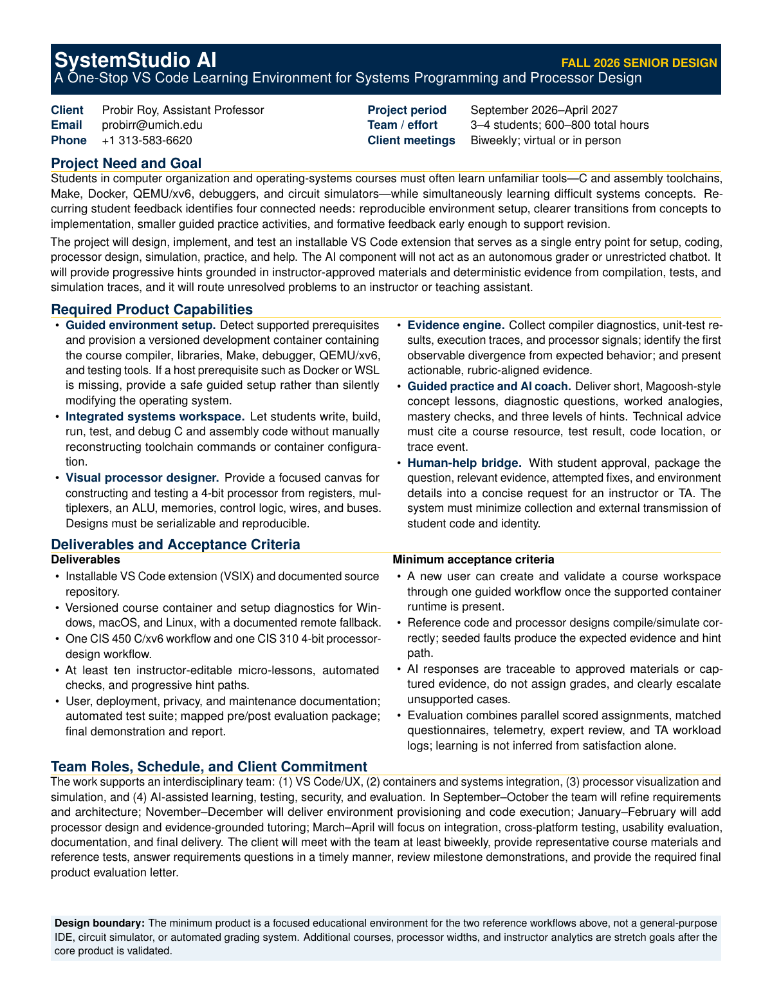

# SystemStudio AI

**A one-stop VS Code learning environment for systems programming and processor design**

This README is the project’s main entry point. Start here, then follow the document path that matches your role or question.

> **Document to send to the senior-design coordinator:** [SystemStudio AI Fall 2026 Senior Design Proposal (PDF)](proposal/SystemStudio_AI_Fall_2026_Senior_Design_Proposal.pdf)

[](proposal/SystemStudio_AI_Fall_2026_Senior_Design_Proposal.pdf)

*Current one-page proposal preview. Click the screenshot to open the PDF. An accelerated CIS 310 extension MVP is now implemented; the broader senior-design product remains in development.*

## Start here

| Reader or purpose | Begin with | Continue with |
|---|---|---|
| **Bruce / senior-design coordinator** | [One-page proposal](proposal/SystemStudio_AI_Fall_2026_Senior_Design_Proposal.pdf) | [Product requirements](docs/design/product-requirements.md) → [implementation roadmap](docs/planning/implementation-roadmap.md) → [evaluation plan](docs/planning/evaluation-plan.md) |
| **Senior-design student team** | [Product requirements](docs/design/product-requirements.md) | [Course workflows](docs/design/course-workflows.md) → [system architecture](docs/design/system-architecture.md) → [implementation roadmap](docs/planning/implementation-roadmap.md) → [decision log](docs/planning/decision-log.md) |
| **Teaching or assessment reviewer** | [Student-evaluation findings](docs/research/student-evaluation-findings.md) | [Measurement research](docs/research/measurement-literature.md) → [RQ-to-instrument matrix](docs/planning/rq-instrument-matrix.md) → [instruments](instruments/README.md) → [analysis plan](docs/planning/analysis-plan.md) |
| **CIS 310 pilot user** | [Extension guide](extension/README.md) | [CIS 310 Fall 2026 course pack](course-packs/cis310-fall2026/README.md) → [student material map](course-packs/cis310-fall2026/STUDENT_MATERIALS.md) |
| **Software developer** | [CIS 310 extension](extension/README.md) | [Technical feasibility](docs/research/technical-feasibility.md) → [system architecture](docs/design/system-architecture.md) → [schemas](schemas/README.md) → [contribution guide](CONTRIBUTING.md) |
| **Privacy, security, or AI-safety reviewer** | [AI safety and privacy](docs/design/ai-safety-and-privacy.md) | [Security policy](SECURITY.md) → [expert feedback rubric](instruments/expert-feedback-rubric.md) → [data dictionary](instruments/data-dictionary.md) |

## Project at a glance

| Item | Current definition |
|---|---|
| Client | Probir Roy, University of Michigan-Dearborn |
| Project period | September 2026--April 2027 |
| Team and effort | 3--4 interdisciplinary students; approximately 600--800 total hours |
| Reference workflows | CIS 450 C/xv6 systems programming and CIS 310 4-bit processor design |
| Product form | Installable VS Code extension with a versioned course environment |
| Current status | CIS 310 extension v0.6.0 combines offline course PDFs, blank/assignment circuit creation, separated homework and projects, and no-setup Irvine32 Classroom/NASM IA-32 teaching profiles; classroom validation remains pending |

SystemStudio AI will combine reproducible environment setup, systems coding, visual processor design, automated evidence collection, guided practice, and a constrained AI coach in a single VS Code experience.

The central principle is: **explain verified evidence, do not invent an answer**. Compiler output, instructor-authored tests, simulator traces, rubrics, and approved course resources remain authoritative. AI may organize and explain that evidence, offer progressive hints, and escalate uncertain cases to an instructor or teaching assistant.

## Why this project

A review of written student evaluations from Fall 2019 through Winter 2026 identified recurring needs in project-heavy systems courses:

- faster and more explanatory formative feedback;
- help translating concepts into working implementations;
- reliable setup for C, assembly, Make, Docker, QEMU/xv6, and circuit tools;
- smaller practice activities and worked examples;
- support when prerequisite knowledge differs across students; and
- a clearer route for obtaining instructor or TA help.

Students also valued hands-on work, group problem solving, live demonstrations, and concrete examples. The evaluations motivate the design; they do **not** establish that AI will improve learning. That remains a hypothesis to test.

## Minimum product

1. **CIS 450 workflow:** environment validation, build/test integration, deterministic evidence, guided practice, and progressive hints for one C/xv6 activity.
2. **CIS 310 workflow:** structured visual design, simulation, signal traces, seeded-fault tests, guided practice, and progressive hints for one 4-bit processor activity.
3. **Human-help bridge:** a student-controlled, redacted packet containing the question, relevant evidence, and attempted fixes.
4. **Evaluation package:** parallel learning assignments, matched pre/post questionnaires, telemetry, blinded expert review, behavioral trust calibration, accessibility observation, and TA workload logs.

The minimum product is not a general-purpose IDE, a general-purpose circuit simulator, an autonomous grader, or an unrestricted chatbot.

### Semester-start CIS 310 pilot

The accelerated Fall 2026 extension now manages a checksum-verified Digital v0.31 installation, detects Java, creates valid blank `.dig` files, opens circuits in Digital when a graphical desktop is available, renders Digital-generated SVG previews inside VS Code, runs embedded circuit tests, publishes eligible circuits to Test Explorer, and generates a starter workspace. The Course Materials view provides 13 embedded offline PDF presentations, three homework references, three project references, assignment-specific circuit buttons, and lecture mappings. The embedded assembly lab supports Irvine32 Classroom and NASM IA-32 teaching profiles without Docker, Visual Studio, or a host assembler. Version 0.7.0 adds a logically grouped sidebar, a skippable/replayable student tutorial, the exact Fall 2026 Canvas course link, and a local evidence-and-routing helper that does not claim to know current deadlines or grade work. The source references remain imported from Fall 2025 and gated for instructor review; Canvas controls current requirements and submission. This remains a technical MVP, not evidence of learning impact or classroom readiness. The generative AI coach, custom processor canvas, help-packet workflow, and broader CIS 450 environment remain senior-design workstreams.


*Actual SVG output from the verified Digital v0.31 end-to-end smoke test. The extension displays this artifact inside its VS Code preview toolbar and results panel.*

## Documentation branches

### 1. Proposal and project definition

- [One-page proposal PDF](proposal/SystemStudio_AI_Fall_2026_Senior_Design_Proposal.pdf)
- [LaTeX proposal source](proposal/SystemStudio_AI_Fall_2026_Senior_Design_Proposal.tex)
- [Product requirements](docs/design/product-requirements.md)
- [Implementation roadmap](docs/planning/implementation-roadmap.md)
- [Architecture decision log](docs/planning/decision-log.md)

### 2. Research foundation

- [Student-evaluation findings](docs/research/student-evaluation-findings.md): recurring needs, strengths, method, and evidence limitations.
- [Technical feasibility](docs/research/technical-feasibility.md): VS Code, containers, simulation, and AI integration.
- [Embedded assembly decision](docs/research/assembly-toolchain.md): course-dialect evidence, no-setup IA-32 common ground, MASM/NASM teaching boundary, and validation limits.
- [Measurement literature](docs/research/measurement-literature.md): validity, self-efficacy, usefulness, trust, workload, pre/post analysis, privacy, and institutional requirements.

### 3. Product and technical design

- [Implemented CIS 310 extension](extension/README.md): installation, commands, current workflow, security controls, and limitations.
- [Course-packs index](course-packs/README.md): versioned instructional materials, mappings, provenance, and release status.
- [Course workflows](docs/design/course-workflows.md): student and instructor paths for CIS 310 and CIS 450.
- [System architecture](docs/design/system-architecture.md): components, trust boundaries, and data flow.
- [AI safety and privacy](docs/design/ai-safety-and-privacy.md): academic integrity, data minimization, execution safety, and escalation.
- [Schemas index](schemas/README.md): versioned course-pack, evidence, and processor-design formats.
- [Evidence-to-requirement traceability](docs/planning/traceability-matrix.md): student needs mapped to product requirements and validation.

### 4. Evaluation design

- [Evaluation plan](docs/planning/evaluation-plan.md): RQ1--RQ8, phases, metrics, and claim boundaries.
- [RQ-to-instrument matrix](docs/planning/rq-instrument-matrix.md): primary and supporting evidence for every RQ.
- [Pre-specified analysis plan](docs/planning/analysis-plan.md): primary outcome, comparison, models, missing data, agreement, safety gates, and reporting.
- [Evaluation instruments index](instruments/README.md): administration and version-control requirements.

### 5. Evaluation instruments

- [Pre-survey](instruments/pre-survey.md) and [post-survey](instruments/post-survey.md)
- [Questionnaire item-to-RQ map](instruments/questionnaire-item-map.md)
- [Immediate task pulse](instruments/task-pulse.md)
- [Student assignment blueprint](instruments/student-assignments.md) and [assignment rubric](instruments/assignment-rubric.md)
- [Behavioral trust-calibration task](instruments/trust-calibration-task.md)
- [Expert feedback rubric](instruments/expert-feedback-rubric.md)
- [Instructor/TA workload log](instruments/ta-workload-log.md)
- [Usability and accessibility protocol](instruments/usability-observation.md)
- [Study data dictionary](instruments/data-dictionary.md)

### 6. Repository governance

- [Contribution guide](CONTRIBUTING.md)
- [Security policy](SECURITY.md)

## Evaluation logic

Different claims require different evidence:

| Claim | Primary evidence |
|---|---|
| Student learning | Blinded score on an alternate-form near-transfer assignment with the AI coach disabled |
| Technical accuracy | Faculty/TA review of correctness and evidence citations |
| Useful feedback | Productive retry behavior after guidance |
| Timeliness | Logged time to the first expert-rated useful response |
| Human workload | Active instructor/TA minutes, including verification and rework |
| Appropriate trust | Behavioral decisions to proceed, verify, reject, or escalate |
| Accessibility | Setup/task completion, critical incidents, and moderated observation |
| Safety | Offline red-team cases, expert flags, incident reports, and escalation behavior |

Survey satisfaction or confidence alone will not be used as proof of learning, accuracy, safety, or workload reduction.

## Build the proposal

```bash
cd proposal
latexmk -pdf -interaction=nonstopmode -halt-on-error \
  SystemStudio_AI_Fall_2026_Senior_Design_Proposal.tex
```

## Data handling

This repository intentionally contains no raw course evaluations, student names, submissions, grades, email, study responses, or linkage keys. Research notes contain aggregated themes only. Any future student-data collection requires the appropriate institutional determination, approved consent/recruitment process, and approved data-management plan.

The draft instruments require expert review, cognitive testing, assignment-form piloting, and protocol freezing before classroom use.
