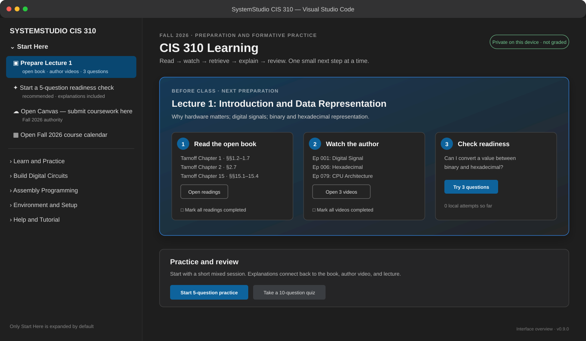
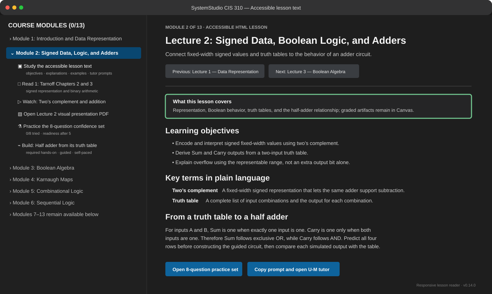
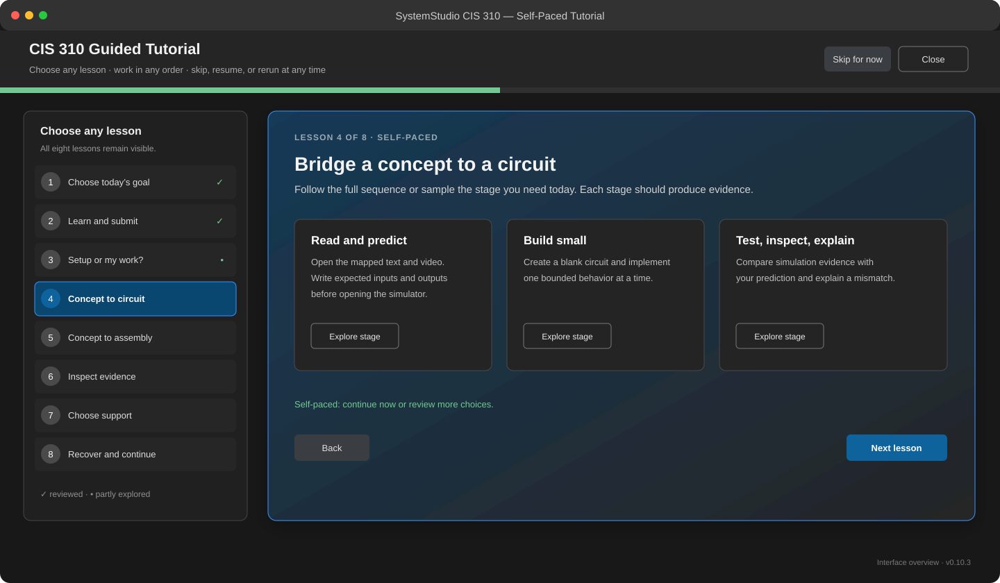
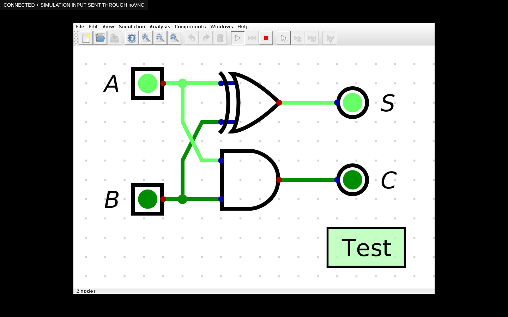

# CIS 310 SystemStudio Course Materials

Active Fall 2026 course materials for **CIS 310: Computer Organization and Assembly Language** at the University of Michigan-Dearborn.

This repository is the student-facing home for the course syllabus, semester calendar, primary accessible HTML lectures, open-textbook/author-video preparation map, optional visual PDF archives, homework and processor-project references, and the SystemStudio CIS 310 VS Code extension with low-stakes practice, Assignment Mission Control, final-project progression, the complete upstream Digital simulator, real assembly toolchain routing, a separate instruction trace tutor, local learning/coursework progress, a local FAQ chat, a U-M Maizey tutor handoff, and a Canvas pre-class question workflow.

## Start here

| Need | Open |
|---|---|
| Current requirements, deadlines, grades, announcements, and submission | [Fall 2026 CIS 310 Canvas](https://canvas.umd.umich.edu/courses/552144) |
| Course policies, outcomes, tools, and topic sequence | [Accessible Fall 2026 HTML syllabus](course-packs/cis310-fall2026/syllabus/CIS310_Fall_2026_Syllabus.html) · [optional print PDF](course-packs/cis310-fall2026/syllabus/CIS310_Fall_2026_Syllabus.pdf) |
| Primary accessible HTML lectures, open-book readings, author videos, homework, projects, and optional visual archives | [Student course-material guide](course-packs/cis310-fall2026/STUDENT_MATERIALS.md) |
| Canvas-ready HTML bodies, standalone pages, page map, and validation manifest | [Accessible HTML lecture bundle](course-packs/cis310-fall2026/canvas/CIS310_Fall2026_Accessible_HTML_Lectures.zip) |
| Extension installation and commands | [SystemStudio extension guide](extension/README.md) |
| Verified reading/video support for every readiness and practice item | [Content alignment audit](extension/CONTENT_ALIGNMENT_AUDIT.md) |
| Practice design, research, and privacy boundary | [Learning Center design](extension/LEARNING_DESIGN.md) |
| AI tutor, FAQ, privacy, and question-queue design | [AI tutor and student-support design](extension/AI_TUTOR_DESIGN.md) |
| Installable VS Code package | [Latest course release](https://github.com/proywm/cis310-systemstudio-course-materials/releases/latest) |

> Canvas is authoritative for live course details. Submit every required deliverable in Canvas and verify that Canvas recorded the submission. SystemStudio does not submit coursework.

**Course team and meeting:** Dr. Probir Roy (`probirr@umich.edu`), instructor, CIS Building Room 230. No Graduate Student Instructor or grader is currently assigned or confirmed for CIS 310; check Canvas and department announcements for any future staffing update. CIS 310 section 001 meets Mondays and Wednesdays, 10:00–11:45 a.m., in ELB 1329. Instructor office hours are Mondays and Wednesdays, 9:30–10:00 a.m. and 12:00–1:00 p.m., or by appointment.









## Fall 2026 calendar

CIS 310 meets on Mondays and Wednesdays from 10:00–11:45 a.m. in ELB 1329. The first class is Wednesday, August 26, and the final regular class is Monday, December 7. The extension shows all 27 regular meetings and the official holiday, recess, study-day, and examination periods. The 8-bit processor and assembly-program presentation occurs during final examination week; its exact date, time, room, order, and deadline are to be announced in Canvas.

Use **CIS 310: Open Fall 2026 Course Calendar** in VS Code to view the calendar. The `.ics` exporter creates confirmed 10:00–11:45 a.m. events in ELB 1329 and includes the final-project examination-week window without inventing its exact logistics or assignment deadlines.

## What students receive

- a locally packaged accessible Fall 2026 HTML syllabus, with an optional print PDF carrying the same content;
- an expanded, sequential **Course Modules** sidebar showing all 13 modules, their local progress, and their accessible HTML lecture, reading, video, optional visual archive, readiness-practice, and guided-lab links;
- 13 primary responsive HTML lectures, grounded in verified source material, with novice explanations, examples, self-checks, and bounded tutor prompts;
- a self-paced Accessible lesson → Read → Watch → Practice → Build/trace path for every module, with five distinct questions for readiness, eight for the full confidence set, mapped explanations, and required hands-on work where appropriate;
- 13 integrity-checked legacy presentation PDFs retained as optional visual archives;
- three homework references, three processor-project milestones, and a separate 8-bit processor/assembly-program final-project planning reference;
- 104 short, evidence-mapped practice questions—exactly eight for each of the 13 presentation resources—with Bloom-level labels and full explanation/justification;
- five-question recommended sessions, topic practice, and 10-question quiz mode;
- explanations, related-lesson links, confidence checks, saved questions, and spaced review;
- a local learning dashboard that reports practice evidence without claiming mastery;
- Assignment Mission Control with local progress, pre-submission file checks and planning ZIPs, Canvas receipt confirmation, a final-project progression bar and self-evaluation, opt-in Canvas-calendar import, missed-class recovery, Digital diagnostics, and structured feedback/release helpers;
- a separately labeled manual grade estimate that applies the 15% / 65% / 20% syllabus weights and drops the two lowest participation-quiz scores, while keeping instructor/GSI evaluation in Canvas visibly distinct;
- a clickable Monday/Wednesday calendar with `.ics` export;
- managed installation and verification of Digital v0.31;
- blank and assignment-specific Digital circuit creation;
- the complete upstream Digital v0.31 editor and simulator, streamed into a VS Code tab from a private Linux display or an extension-managed Docker Desktop runtime on Windows/macOS, with the native window retained only as an explicit fallback;
- seven lecture-mapped guided circuit builds, including a step-by-step half adder and K-map implementation, with fresh non-overwriting files and local checklist progress;
- circuit preview and deterministic testcase support;
- actual NASM/ELF32 build, link, and execution on Linux; exact Microsoft MASM/Irvine32 routing on a configured Windows host; and a separately labeled non-assembler instruction trace tutor;
- five lecture-mapped assembly walkthroughs covering arithmetic, flags/branches, an array loop, a stack frame, and virtual input;
- a visible eight-lesson, freely navigable, skippable, resumable, and rerunnable tutorial;
- a local helper for topic, tool, calendar, and Canvas routing;
- an attempt-first AI learning-coach checkpoint and graded-work boundary before the U-M Maizey handoff; and
- a collapsible chat-style help entry, local FAQ, and structured Canvas Questions Before Class draft.

No external document-hosting account is required to open the packaged syllabus, HTML lectures, or optional PDF archives. The required Tarnoff book and companion videos open from the author's official ETSU/YouTube sources; the extension does not redistribute them or use Google Drive.

## Install the extension

Download `systemstudio-cis310.vsix` from the [latest release](https://github.com/proywm/cis310-systemstudio-course-materials/releases/latest), then run:

```bash
code --install-extension systemstudio-cis310.vsix
```

Alternatively, use **Extensions: Install from VSIX...** in desktop VS Code. Reload the VS Code window, open the **SystemStudio CIS 310** activity-bar view, and start the guided tutorial.

Java 8 or newer is required for Full Digital on Linux and for native fallback/CLI use. On Windows/macOS, Docker Desktop supplies the pinned Java/X11 runtime used to embed upstream Digital in a VS Code tab. The extension can privately prepare Xvfb/x11vnc on Debian/Ubuntu headless hosts. Real NASM requires NASM and GNU `ld`; the Debian/Ubuntu NASM package can be installed privately after confirmation. Exact MASM/Irvine32 requires Windows, Microsoft `ml.exe`/`link.exe`, and the official Irvine library. The trace tutor has no external toolchain requirement but is explicitly not an assembler.

## Repository layout

```text
course-packs/cis310-fall2026/   Active syllabus, presentations, and assignments
extension/                      SystemStudio CIS 310 VS Code extension
CONTRIBUTING.md                 Course-material and extension contribution rules
SECURITY.md                     Security and privacy reporting
```

## Help and privacy

The local FAQ does not transmit conversations, reading/video checkmarks, practice history, student code, circuit files, grades, or telemetry to an AI service. Learning history is stored locally in VS Code and can be reset by the student. Opening U-M Maizey or Canvas leaves VS Code and is governed by U-M's service notices. The extension contains no shared faculty LLM key or Canvas token. External book/video links have their own privacy practices. Do not commit student submissions, grades, credentials, private correspondence, answer keys, hidden tests, or instructor solutions to this repository.

For a course requirement or deadline, check Canvas first. For a technical question, include what you expected, what happened, the exact evidence, and what you already tried.

## Development checks

```bash
cd extension
npm ci
npm run check
npm run package
```

The course pack and packaged extension verify local material hashes before use.
