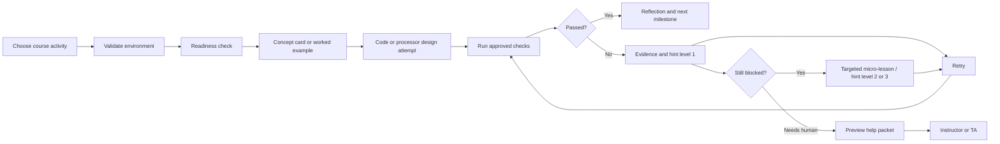

# Course Workflows

## Shared student journey

## Magoosh-style learning loop

Each micro-lesson should take approximately 5--10 minutes and include:

1. a clearly stated objective;
2. prerequisite concepts;
3. a concise explanation;
4. a worked example that is analogous to, but not the answer to, the assignment;
5. two or three diagnostic questions;
6. an explanation for every answer choice;
7. a small coding or design task;
8. an immediate deterministic check; and
9. a recommendation to retry the original milestone.

The engine recommends a lesson from explicit evidence. It does not infer a student's general ability.

## CIS 450 reference workflow

### Activity A: environment and C readiness

1. Student selects **CIS 450: Lab 0**.
2. Extension checks the container runtime and creates the versioned workspace.
3. Preflight validates GCC/Clang, Make, GDB, QEMU, Git, and the xv6 source revision.
4. Student compiles and runs a small C program.
5. Checks exercise pointers, arrays, process creation, and Make targets.
6. Evidence distinguishes compiler, linker, runtime, and test failures.
7. The coach maps the failure to a short refresher or offers a limited hint.

### Activity B: xv6 scheduler or concurrency milestone

Suggested milestones:

1. build and boot the unmodified reference image;
2. locate the relevant process/scheduler data structures;
3. add a trace-only observation without changing behavior;
4. implement one isolated policy decision;
5. run deterministic scheduler tests;
6. inspect fairness, ordering, starvation, and regression evidence; and
7. write a short explanation connecting the code behavior to the OS concept.

Example evidence:

- build target and compiler result;
- kernel boot completion;
- expected and observed scheduling order;
- process-state transition trace;
- timeout/deadlock marker;
- known invariant failure; and
- regression-test status.

The AI can explain why the evidence suggests a concept to inspect. It must not generate a complete scheduler implementation.

## CIS 310 reference workflow

### Activity: construct and validate a 4-bit processor

Suggested milestones:

1. complete a readiness check on binary representation, gates, and combinational versus sequential behavior;
2. build and test the ALU independently;
3. add registers, clock, and program counter;
4. add instruction and data memories;
5. connect multiplexers and the data path;
6. implement the control table;
7. execute one instruction step by step;
8. run a small program; and
9. explain one trace in terms of fetch, decode, execute, memory, and write-back behavior.

Example evidence:

- component presence and connectivity;
- port width and direction;
- truth-table mismatch;
- clock-edge behavior;
- expected and observed control word;
- expected and observed bus/register value;
- earliest divergent cycle and signal; and
- passing component tests with failing integration test.

The visual editor should highlight the active path and the first divergent signal. The AI explanation should reference those identifiers rather than reason from an image alone.

## Asking a question

The **Ask Coach** action should offer structured starters:

- What does this evidence mean?
- Which concept should I review?
- Give me a level-1 hint.
- Why is this likely an environment problem rather than a code problem?
- Show me the first point where observed behavior differs from expected behavior.
- Help me form a question for my instructor or TA.

Students may also enter free text, but the system should attach only evidence and artifacts that they explicitly select or that the course pack marks as safe and necessary.

## Human escalation workflow

1. Student selects **Request Human Help**.
2. Extension proposes a packet and shows every included field.
3. Student removes or redacts content.
4. Extension generates a Markdown/PDF/clipboard export.
5. Student chooses how to send it through an approved communication channel.
6. The local record stores what was shared, not the instructor's private response.

The MVP should generate the packet but should not automatically email or post it.

## Instructor workflow

1. Author or update a versioned course pack.
2. Validate the schema and run all reference/seeded-fault tests.
3. Preview deterministic messages and AI context packages.
4. Publish the signed pack and container version.
5. Review aggregated, deidentified blocker categories only if institutional policy and study approval permit collection.
6. Respond to escalated cases and improve the course pack where many students encounter the same ambiguity.

## Design principle

The product should shorten the loop between an attempt and useful evidence. It should not use automation to avoid answering student questions or to compensate for unclear, untested assignments.
