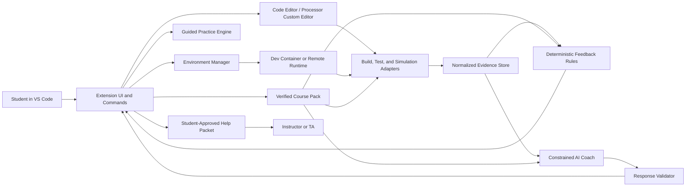

# System Architecture

## Architectural objective

Present one coherent VS Code experience while keeping deterministic analysis, course authority, AI explanation, and human communication as separate layers.



## Components

### 1. Extension shell

Responsibilities:

- register commands, views, tasks, tests, diagnostics, and custom editors;
- enforce workspace trust and feature availability;
- coordinate course-pack selection and version display;
- render evidence, hints, lessons, progress, and help-packet previews; and
- contain no course-specific test logic.

Recommended technology: TypeScript and the stable VS Code Extension API.

### 2. Course-pack loader

A course pack is the instructor-controlled authority for one activity or assignment family. It contains:

- unique ID and semantic version;
- course and assignment metadata;
- learning objectives and prerequisites;
- approved resource identifiers and content hashes;
- Dev Container reference and supported platforms;
- allowed build/test/simulation commands;
- evidence categories and rubric links;
- micro-lessons and diagnostic items;
- deterministic feedback rules;
- AI hint policy; and
- signature or integrity metadata.

The loader validates the pack against the schema, verifies integrity, and exposes read-only data to other components.

### 3. Environment manager

Responsibilities:

- check host prerequisites without modifying them;
- generate or open the course Dev Container;
- run a known preflight workload;
- distinguish failures by layer;
- support cancel, retry, and export diagnostics; and
- offer a remote fallback when local virtualization is unavailable.

### 4. Build, test, and simulation adapters

Adapters translate course-pack operations into controlled processes. They must:

- use fixed executable and argument definitions;
- run inside the approved container/runtime;
- impose time, memory, filesystem, and network limits;
- capture stdout, stderr, exit status, tests, traces, and artifacts;
- redact known identifiers; and
- emit only normalized evidence to upper layers.

### 5. Processor editor and simulator

The target senior-design architecture stores the processor design as text-backed JSON. The visual editor is a projection of that model. The simulation core must be independent of the webview and expose a deterministic API such as:

```text
load(design)
reset()
setInput(name, value)
stepClock()
readSignal(name)
runTest(testVector)
exportTrace()
```

This interface allows unit tests and alternate renderers without starting VS Code.

The accelerated CIS 310 MVP provides an earlier adapter layer rather than this full custom editor. It manages Digital v0.31 in extension global storage, uses the official CLI for test and SVG evidence, displays the SVG inside a custom editor, and opens Digital's native Swing window for graphical editing. The adapter is implemented and locally smoke-tested; the JSON editor and internal simulator above remain planned senior-design scope.

### 6. Evidence store

Evidence is append-only for one run and contains:

- source type and tool version;
- course-pack and assignment versions;
- time of observation;
- pass/fail/unknown status;
- expected and observed values when safe;
- file/range, processor component, signal, or trace coordinates;
- concept and rubric identifiers supplied by the course pack; and
- redaction status.

Evidence is not a grade. It records observable behavior.

### 7. Deterministic feedback rules

Known evidence patterns should produce instructor-authored messages before AI is consulted. Examples:

- container runtime unreachable;
- compiler absent or wrong architecture;
- Make target missing;
- known xv6 build mismatch;
- ALU control output differs on a named test vector; or
- a register updates on the wrong clock edge.

This layer is cheaper, faster, easier to test, and more authoritative than model generation.

### 8. Constrained AI coach

The coach receives a bounded context package and returns structured output. It cannot execute commands, alter code, change course content, record a grade, or send a message.

Required response fields:

```json
{
  "diagnosis": "short explanation",
  "evidenceIds": ["evidence-id"],
  "resourceIds": ["approved-resource-id"],
  "conceptId": "concept-id",
  "hintLevel": 1,
  "hint": "next reasoning step",
  "confidence": 0.0,
  "escalate": false
}
```

The response validator rejects unknown identifiers, disallowed hint levels, missing evidence for technical claims, unsafe commands, and schema violations.

### 9. Guided-practice engine

Lessons and diagnostic items come from the course pack. Mastery is a local learning-state record, not a grade. The engine maps evidence categories to recommended lessons and schedules a retry after the student attempts the relevant task again.

### 10. Help-packet generator

The generator creates a local preview first. No external transmission occurs until the student approves the exact content. A packet should include the question, environment/course-pack versions, selected evidence, attempted steps, and optionally selected code or processor components.

## Trust boundaries

| Boundary | Main risk | Required control |
|---|---|---|
| Workspace to extension | Malicious repository configuration | Workspace Trust; limited mode; validated course pack |
| Extension to runtime | Arbitrary command execution | Fixed process definitions; container sandbox; resource limits |
| Student artifact to parser | Crafted files or excessive input | Schema validation; size limits; timeouts |
| Evidence to AI service | Privacy loss or prompt injection | Redaction; allowlist context; treat student text as data; no secrets |
| AI response to UI | Fabricated or unsafe advice | Structured schema; citation validation; confidence/escalation policy |
| Help packet to human | Oversharing student data | Preview, redaction, explicit approval, local audit record |

## Failure behavior

- **No container runtime:** show approved setup/remote options; do not attempt privileged silent installation.
- **Course-pack integrity failure:** disable executable actions and identify the invalid pack/version.
- **Test harness failure:** distinguish infrastructure failure from student failure and avoid instructional conclusions.
- **AI unavailable:** preserve deterministic evidence, rules, lessons, and human escalation.
- **AI low confidence or invalid citations:** suppress the generated diagnosis and recommend human help.
- **Simulation timeout:** preserve the last valid state and identify possible combinational cycles or resource exhaustion.

## Deployment model

The preferred MVP deployment is:

- a signed VSIX extension;
- prebuilt versioned course-container images;
- instructor-distributed course packs;
- local evidence and mastery storage;
- an optional university-approved AI endpoint; and
- user-controlled export of help packets.

An institutional production deployment will require decisions about authentication, endpoint approval, log retention, accessibility testing, and support ownership.
